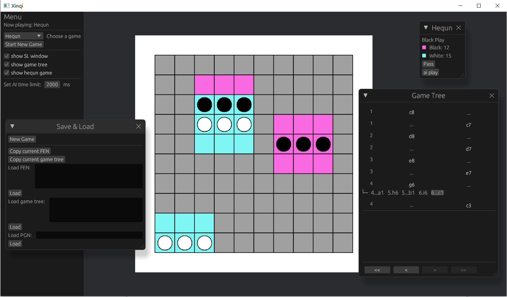

# 新棋（Xinqi）

Xinqi 是八卦用 [Bevy](https://github.com/bevyengine/bevy) 制作的用于本地下棋和复盘分析新棋的软件！



## 已制作的新棋

合群之落（Hequn）

占地棋（Zhandi）

形象棋（Xingxiang）

[棋规文档](rules.md)

## 已实现的功能

游戏树

通过 FEN/PGN/游戏树代码 进行局面的保存/读取

朴素的 MCTS AI

## 本地构建

构建

```
cargo build --release
```

运行

```
cargo run --release
```

